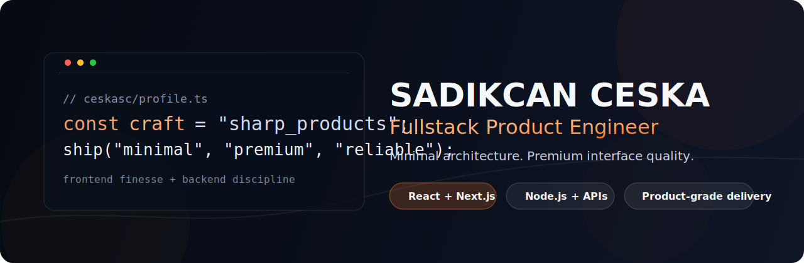



  

  <h1>Sadıkcan Çeşka</h1>
  
<strong>Fullstack Product Engineer</strong> building fast, elegant, and scalable digital products.

  

    
    
    
  

 

<table>
  <tr>
    <td width="50%" valign="top">
      <h3>Profile</h3>
      

        I design and ship product-grade web systems with a strong focus on
        performance, maintainability, and clear UX.
      

      <ul>
        <li>Production-ready frontend architecture</li>
        <li>Reliable backend services and APIs</li>
        <li>Clean delivery flow from idea to release</li>
      </ul>
    </td>
    <td width="50%" valign="top">
      <h3>Current Focus</h3>
      <ul>
        <li>High-performance React / Next.js applications</li>
        <li>Scalable Node.js + PostgreSQL systems</li>
        <li>Design systems and premium UI execution</li>
      </ul>
      

        Open to selective collaborations on SaaS and product engineering.
      

    </td>
  </tr>
</table>

  <h3>Core Stack</h3>
  
<strong>Product Engineering</strong>

  

    
  

  
<strong>Tooling</strong>

  

    
  

  <h3>GitHub Metrics</h3>
  
  

  <h3>Connect</h3>
  

    <a href="https://ceskasc.github.io/">Portfolio</a> |
    <a href="https://github.com/ceskasc?tab=repositories">Repositories</a> |
    <a href="mailto:contact@sadikcanceska.com">Email</a>
  

  Minimal systems. Premium interfaces.

