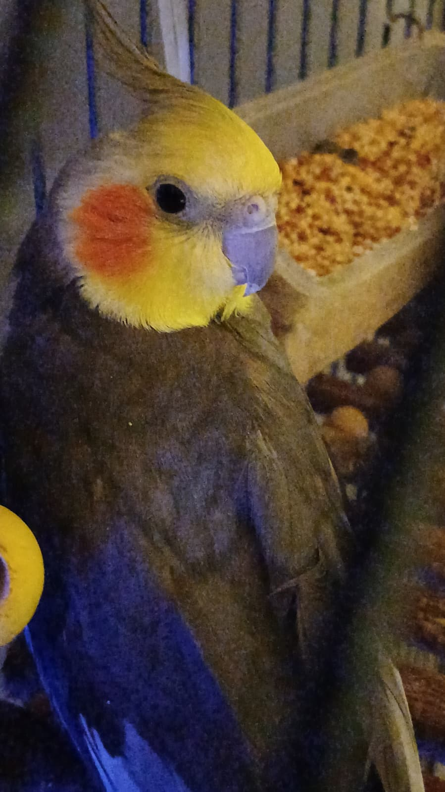

  

  

    <strong>Senior Fullstack Developer</strong> 
    Building fast, scalable, and visually sharp products with React, Next.js, and Node.js.
  

  

    
    
    
  

---

## About Me

<table>
  <tr>
    <td width="62%" valign="top">
      

        I am based in Ankara and focused on shipping high-quality web products with clean architecture and strong UI detail.
      

      

        I enjoy solving real product problems, turning rough ideas into production-ready software, and mentoring teams to move faster with better code quality.
      

      <ul>
        <li>Building high-performance SaaS platforms</li>
        <li>Contributing to open-source UI components</li>
        <li>Improving system design for microservice environments</li>
      </ul>
    </td>
    <td width="38%" align="center" valign="middle">
      
       
      Limon, Chief Happiness Officer
    </td>
  </tr>
</table>

## Current Focus

- Advanced animation systems with GSAP and Three.js
- Reliable backend architecture with Node.js and PostgreSQL
- Performance optimization and DX improvements in Next.js projects

## Tech Stack

  

## GitHub Stats

  
  

  

## Activity Graph

  

## Connect

  

  

