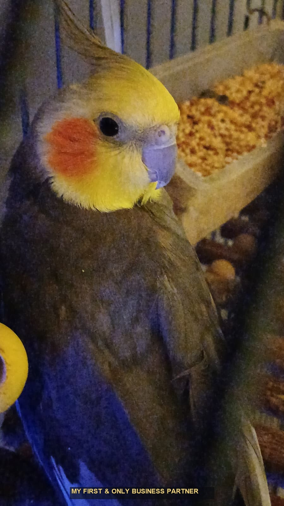

  

<h1 align="center">Sad&#305;k Can &#199;e&#351;ka</h1>

  

  

  <em>"I don't just ship features. I craft products that feel intentional, fast, and memorable."</em>

  
  
  

  
  
  

---

## Signature Statement

I am a product-focused software engineer from Ankara, building fullstack systems with pixel-level UI care and architecture-level backend rigor.  
My default mode is simple: understand the business pressure, design the cleanest technical path, and ship with production confidence.

What defines my style:
- Fast interfaces that still feel elegant
- Backend services that stay reliable under scale
- Clean, maintainable codebases that teams can grow on
- Product decisions driven by user impact, not noise

---

## About The Builder

<table>
  <tr>
    <td width="62%" valign="top">
      <h3>Who I Am</h3>
      

        I build modern web applications end-to-end with React, Next.js, Node.js, and PostgreSQL.
        My main focus is turning complex product ideas into stable, scalable systems with clear UX and strong engineering discipline.
      

      <h3>What I Optimize For</h3>
      <ul>
        <li><strong>Speed:</strong> low-latency UX and fast delivery cycles</li>
        <li><strong>Quality:</strong> readable architecture, testable modules, robust release flow</li>
        <li><strong>Clarity:</strong> decisions documented, ownership clear, execution measurable</li>
      </ul>
      <h3>Current Mission</h3>
      <ul>
        <li>Building high-performance SaaS applications</li>
        <li>Designing reusable UI systems and component libraries</li>
        <li>Improving distributed backend design for long-term scale</li>
      </ul>
    </td>
    <td width="38%" align="center" valign="middle">
      
       
      <strong>Limon</strong> - My first and only business partner.
    </td>
  </tr>
</table>

---

## Current Focus Areas

1. Advanced animation pipelines with GSAP and Three.js
2. Scalable service architecture in Node.js ecosystems
3. Clean microservice communication and observability
4. Performance budgets and Core Web Vitals excellence
5. Strong developer experience in large Next.js codebases

---

## Engineering Playbook

  
<strong>How I approach product delivery</strong>

   
  <ul>
    <li><strong>Discovery:</strong> clarify user pain, define measurable outcomes, remove ambiguity early</li>
    <li><strong>Design:</strong> architecture first, API contracts second, implementation third</li>
    <li><strong>Execution:</strong> iterate in vertical slices, keep feedback loops tight, ship continuously</li>
    <li><strong>Hardening:</strong> profiling, testing, observability, and production-readiness checks</li>
  </ul>

  
<strong>Quality standards I hold in production code</strong>

   
  <ul>
    <li>Clear boundaries between domain logic and UI concerns</li>
    <li>Zero "magic" behaviors without explicit documentation</li>
    <li>Performance-aware rendering and data-fetching strategies</li>
    <li>Predictable deployment and rollback workflows</li>
  </ul>

---

## Tech Universe

  

---

## GitHub Highlights

  

  

---

## Let's Build Something Exceptional

  

    I am open to selective collaborations around product engineering, SaaS platforms, and performance-driven web systems.
  

  

    
  

  

    
  

  

