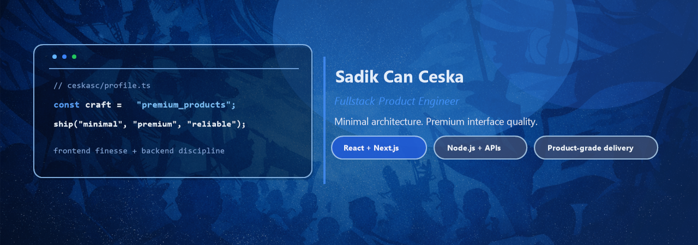

  

  <h1>Sad&#305;k Can &#199;e&#351;ka</h1>
  
<strong>Fullstack Product Engineer</strong> building product-grade web systems with clean architecture and sharp interface quality.

  

    
    
    
  

<table>
  <tr>
    <td width="50%" valign="top">
      <h3>What I Build</h3>
      <ul>
        <li>High-performance React and Next.js product experiences</li>
        <li>Robust Node.js APIs with scalable data workflows</li>
        <li>Delivery pipelines that stay reliable from idea to release</li>
      </ul>
    </td>
    <td width="50%" valign="top">
      <h3>Current Focus</h3>
      <ul>
        <li>Premium UI systems with measurable UX quality</li>
        <li>PostgreSQL, Redis, and pragmatic cloud operations</li>
        <li>Shipping maintainable products with strong engineering standards</li>
      </ul>
    </td>
  </tr>
</table>

  <h3>Core Stack</h3>
  

    
  

  

    
  

  <h3>GitHub Metrics</h3>
  

    
    
  

  

    
    
  

  <h3>Contribution Snake</h3>
  <picture>
    <source media="(prefers-color-scheme: dark)" srcset="https://raw.githubusercontent.com/ceskasc/ceskasc/output/github-snake-dark-blue.svg" />
    <source media="(prefers-color-scheme: light)" srcset="https://raw.githubusercontent.com/ceskasc/ceskasc/output/github-snake-blue.svg" />
    
  </picture>
   
  Auto-generated daily via GitHub Actions.

  Minimal architecture. Premium execution.

