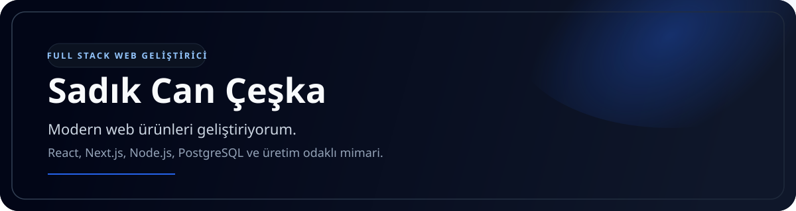

  

<h1 align="center">Sadık Can Çeşka</h1>

  <strong>Full stack web geliştiricisiyim.</strong>

  Arayüzden backend katmanına kadar modern, hızlı ve temiz web ürünleri geliştiriyorum.

  <a href="https://ceskasc.github.io/">Portfolyo</a>
  ·
  <a href="https://github.com/ceskasc">GitHub</a>
  ·
  <a href="mailto:contact@sadikcanceska.com">E-posta</a>

  

  Minimal. Temiz. Üretim odaklı.

