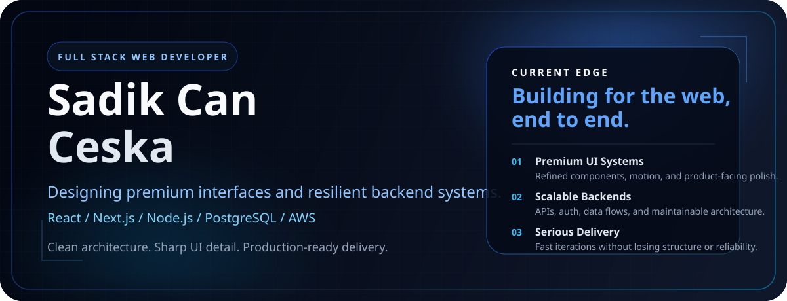
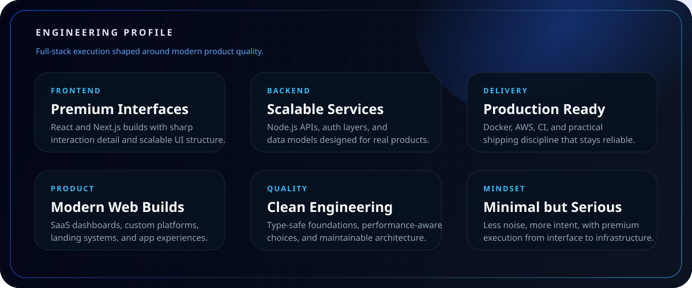

  

<h1 align="center">Sadik Can Ceska</h1>

  <strong>Full Stack Web Developer</strong> building refined interfaces, reliable backend systems, and production-ready web products with a clean engineering mindset.

  
  
  

  Minimal surface. Premium execution. Full-stack product thinking.

  

  <h3>Core Stack</h3>
  

    
  

  <h3>GitHub Snapshot</h3>
  

    
    
  

  Crafting web products from interface to infrastructure.

