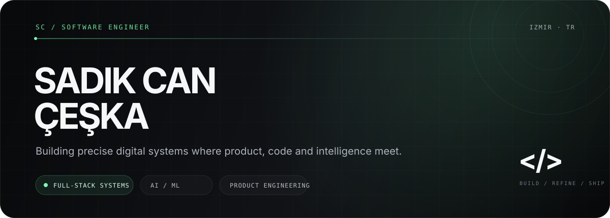

  

 

  <a href="https://ceskacan.com/"><b>Portfolio</b></a>
  &nbsp;&nbsp;·&nbsp;&nbsp;
  <a href="https://github.com/ceskasc?tab=repositories"><b>Work</b></a>
  &nbsp;&nbsp;·&nbsp;&nbsp;
  <a href="https://www.linkedin.com/in/ceskacan"><b>LinkedIn</b></a>
  &nbsp;&nbsp;·&nbsp;&nbsp;
  <a href="mailto:sadktyk@gmail.com"><b>Contact</b></a>

 

> I build software with a bias toward clarity: thoughtful interfaces, durable systems, measurable performance and the smallest amount of complexity that can do the job well.

 

### Profile

Software engineer working across **product engineering, full-stack systems and applied AI**. I care about the entire path from an idea to a reliable product — architecture, interaction, implementation, testing, performance and delivery.

My work sits at the intersection of **engineering precision** and **product taste**: systems should be technically sound, but they should also feel intentional to the people using them.

 

### Selected work

**01 — [AppAnvil](https://github.com/ceskasc/appanvil)**  
Developer tooling for building, validating and sharing reproducible Windows application setups. · [Live ↗](https://ceskasc.github.io/appanvil/)

**02 — [NoirWave](https://github.com/ceskasc/NoirWave)**  
A modern music experience built around real playback, focused state management and an immersive full-screen player. · [Live ↗](https://ceskasc.github.io/NoirWave/)

**03 — [Lunara](https://github.com/ceskasc/tetris)**  
A full-stack game platform with persistent data, authentication, progression and real-time 1v1 sessions.

**04 — [Architect Portfolio](https://github.com/ceskasc/architect-portfolio)**  
A deliberately lightweight responsive portfolio focused on semantic frontend architecture and visual restraint. · [Live ↗](https://ceskasc.github.io/architect-portfolio/)

**05 — [QR Generator](https://github.com/ceskasc/qr-generator)**  
Client-side QR composition with logo support and high-resolution export. · [Live ↗](https://ceskasc.github.io/qr-generator/)

 

### Core stack

`TypeScript` &nbsp; `JavaScript` &nbsp; `Python` &nbsp; `React` &nbsp; `Next.js` &nbsp; `Node.js` &nbsp; `.NET` &nbsp; `PostgreSQL` &nbsp; `Redis` &nbsp; `Docker` &nbsp; `AWS` &nbsp; `GitHub Actions`

AI / ML · realtime systems · APIs · relational data · testing · CI/CD · performance · accessibility

 
 

### Engineering approach

**Reduce noise. Design the boundary. Make state explicit. Test the risky path. Measure before optimizing. Ship, observe, refine.**

 

---

  Sadık Can Çeşka · Software Engineer · İzmir, Türkiye
   
  <a href="https://ceskacan.com/">ceskacan.com</a>

