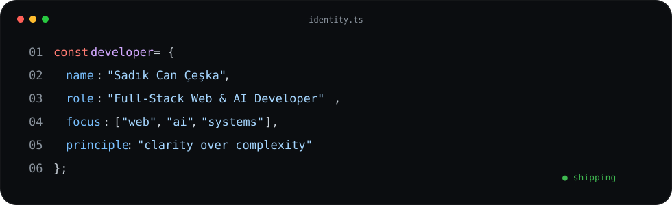

<div align="center">

# Sadık Can Çeşka

### Full-Stack Web & AI Developer

Engineering production-grade web and AI systems with a global product mindset.

<br>

[Website](https://ceskacan.com/) &nbsp;·&nbsp; [LinkedIn](https://www.linkedin.com/in/ceskacan) &nbsp;·&nbsp; [Email](mailto:sadktyk@gmail.com)

<br>



</div>

<br>

I design and build complete digital products — from interface architecture and frontend systems to backend services, data layers and AI-powered experiences.

My approach is simple: **strong engineering, restrained design, measurable performance and as little accidental complexity as possible.**

<br>

## Languages & systems

<div align="center">
  
</div>

<br>

`TypeScript` · `JavaScript` · `Python` · `C#` · `HTML` · `CSS` · `SQL`

`React` · `Next.js` · `Node.js` · `.NET` · `PostgreSQL` · `Redis`

`Docker` · `AWS` · `Git` · `GitHub Actions` · `REST` · `Realtime Systems` · `AI / ML`

<br>

## Web

```ts
const product = await build({
  frontend: ["React", "Next.js", "TypeScript"],
  backend: ["Node.js", ".NET", "PostgreSQL"],
  priorities: ["performance", "accessibility", "maintainability"],
});
```

## AI

```python
system = AIProduct(
    models="fit for purpose",
    context="relevant",
    evaluation="measurable",
    experience="human-centered",
)

system.ship()
```

<br>

## Engineering focus

**Full-stack product engineering** &nbsp;·&nbsp; **AI systems** &nbsp;·&nbsp; **developer experience** &nbsp;·&nbsp; **realtime applications** &nbsp;·&nbsp; **system design** &nbsp;·&nbsp; **performance**

<br>

---

<div align="center">

<sub>Design the boundary. Keep the system clear. Ship what matters.</sub>

</div>
